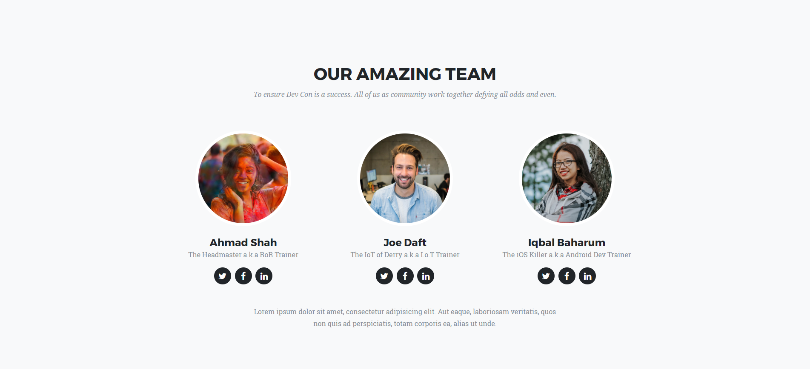

# [DevCon : Academia](http://dynamicdune.com/uat/devcon/)

[DevCon : Academia](http://dynamicdune.com/uat/devcon/) is a mock up website develop by Hafiz by using Agency Template from startbootstrap.com. This template is based on bootstrap and jquery and most of the structure has been updated and amend to suits for DevCon : Academia actual and dummy content. There are also a PHP function in which it will send an email to the enquirer whenever they submit the form.

## Screenshots

**[View Live Preview](https://blackrockdigital.github.io/startbootstrap-agency/)**

## Status

This site is partial completed. If to futher update the content, this readme will be updated for any incoming future update.
